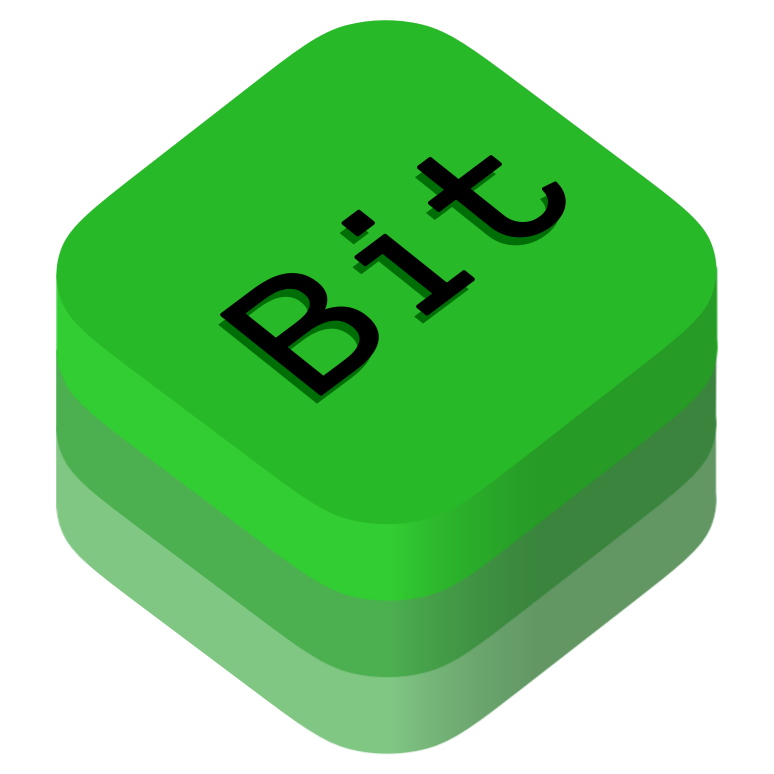

# bitKit (alpha)
Comunicaciones P2P seguras y privadas para la era moderna.

Paquete Swift modular para comunicaciones P2P seguras, privadas y resistentes a la censura. Proporciona una arquitectura completa de mensajería peer-to-peer con soporte para Bluetooth Low Energy (BLE), Nostr relays globales, geolocalización.

## Características Principales

- **🔐 Encriptación End-to-End**: Protocolo Noise con forward secrecy perfecta
- **📡 Múltiples Transportes**: BLE mesh offline, Nostr relays globales, Tor
- **🌍 Geolocalización**: Mensajería basada en ubicación y canales geo
- **🎵 Multimedia Completo**: Voz, imágenes, video, streaming y transferencias de archivos
- **👥 Grupos y Moderación**: Chat grupal con moderación distribuida y analytics
- **🛡️ Anonimato Avanzado**: Tor, zero-knowledge proofs, verificación de identidad
- **📊 Analytics de Comunidad**: Métricas detalladas, insights y dashboards
- **🔄 Arquitectura Reactiva**: Combine publishers para actualizaciones en tiempo real
- **🌐 Coordinación Inteligente**: Enrutamiento automático y failover entre transportes
- **💾 Persistencia Segura**: Keychain con migración y backup
- **📱 Multiplataforma**: iOS 17+ y macOS 14+

## Instalación

### Swift Package Manager

Añade a tu `Package.swift`:

```swift
dependencies: [
    .package(url: "https://github.com/antares500/bitKit.git", from: "1.1.0")
]
```

Elige los targets según tus necesidades o usa presets recomendados:

#### Presets Recomendados
```swift
// Básico (mensajería simple)
.target(name: "MiApp", dependencies: [
    "BitCore",           // Núcleo requerido
    "BitCommunications"  // Coordinación básica
])

// Completo (todo incluido)
.target(name: "MiApp", dependencies: [
    "BitKit"  // Incluye todos los módulos
])

// Personalizado (elige módulos)
.target(name: "MiApp", dependencies: [
    "BitCore",                  // Núcleo con comunicaciones básicas
    "BitTransport",             // BLE + Nostr
    "BitGeo",                   // Geolocalización
    "BitState",                 // Persistencia
    "BitMedia",                 // Multimedia
    "BitTor",                   // Anonimato
    "BitChatGroup",             // Chat y grupos
    "BitReliability",   // Confiabilidad, sync, verificación
    "BitAnalytics"              // Métricas
])
```

## Arquitectura

```
bitKit
├── BitCore          # Núcleo: protocolos, encriptación, utilidades
├── BitTransport     # Transportes: BLE mesh + Nostr relays
├── BitGeo           # Geolocalización y canales geo
├── BitState         # Persistencia segura (Keychain)
├── BitMedia         # Manejo de multimedia
├── BitTor           # Anonimato con Tor
├── BitCommunications # Coordinación de transportes
├── BitChatGroup     # Chat individual y grupal
├── BitReliability   # Confiabilidad, sync, verificación
├── BitAnalytics     # Analytics y métricas de comunidad
└── BitKit           # Todo incluido (preset completo)
```

## Configuración de Redes

bitKit permite crear **tu propia red** o **incluirte en la red bitchat** existente. Ambas opciones son compatibles con la última versión de bitchat si el usuario lo necesita.

### Mi Propia Red
- Configura aislamiento usando relays Nostr específicos o firmas de app personalizadas.
- Los mensajes se firman con claves únicas, asegurando que solo apps autorizadas los procesen.
- **Aviso**: Debes cumplir con los estándares de la red original marcados por Jack Dorsey y adaptarte a sus actualizaciones. bitchat no leerá mensajes de redes propias sin configuración explícita.

### Incluirme en la Red Bit
- Usa las mismas APIs y dependencias que bitchat para interoperabilidad completa.
- bitKit se alinea con la última versión de bitchat, permitiendo inclusión en su red mediante configuración compartida (ej. relays públicos o claves compatibles).

Ejemplo de configuración para compatibilidad:
```swift
// Para red propia: configura relays y firmas personalizadas
let communications = BitCommunications(
    customRelays: ["tu-relay.nostr"], 
    appSignature: "tu-firma-unica"
)

// Para incluirte en bitchat: usa configuración por defecto compatible
let communications = BitCommunications()  // Usa relays y firmas de bitchat
```

### Configuración Básica

Para comenzar con bitKit, sigue nuestro [Ejemplo 01: Configuración Básica](Documentation/Examples/01_Basic_Configuration.md) que cubre:
- Implementación de protocolos requeridos (KeychainManagerProtocol, BitDelegate)
- Configuración inicial de servicios
- Manejo de eventos básicos

### Guía Completa de Implementación

Explora nuestras guías detalladas para todas las funcionalidades:

#### 🚀 **Primeros Pasos**
- **[01: Configuración Básica](Documentation/Examples/01_Basic_Configuration.md)**: Fundamentos y setup inicial
- **[02: BLE Mesh Networks](Documentation/Examples/02_BLE_Mesh_Configuration.md)**: Redes mesh offline con enrutamiento inteligente
- **[03: Nostr Integration](Documentation/Examples/03_Nostr_Integration.md)**: Comunicación global a través de relays públicos
- **[04: Geolocalización y Mensajería Local](Documentation/Examples/04_Geolocation_Local_Messaging.md)**: Mensajería basada en ubicación
- **[05: Características Avanzadas](Documentation/Examples/05_Advanced_Features_Customization.md)**: Arquitectura extensible

#### 🎵 **Multimedia y Contenido**
- **[06: Manejo de Multimedia](Documentation/Examples/06_Multimedia_Handling.md)**: Voz, imágenes, video y streaming
- **[07: Persistencia de Estado y Backup](Documentation/Examples/07_State_Persistence_Backup.md)**: Gestión de identidad y respaldo seguro
- **[08: Chat Grupal y Moderación](Documentation/Examples/08_Group_Chat_Moderation.md)**: Grupos, moderación y analytics

#### 🔐 **Seguridad y Privacidad**
- **[09: Seguridad Avanzada y Tor](Documentation/Examples/09_Advanced_Security_Tor.md)**: Anonimato, verificación de identidad
- **[10: Coordinación de Transportes](Documentation/Examples/10_Transport_Coordination.md)**: Enrutamiento inteligente y failover
- **[11: Transferencias de Archivos y Streaming](Documentation/Examples/11_File_Transfers_Streaming.md)**: Archivos grandes y streaming en tiempo real
- **[12: Verificación de Identidad y Confianza](Documentation/Examples/12_Identity_Verification_Trust.md)**: Sistema de confianza distribuido

#### 📊 **Analytics y Comunidad**
- **[13: Analytics, Métricas y Comunidad](Documentation/Examples/13_Analytics_Metrics_Community.md)**: Insights y dashboards

#### 🔧 **Utilidades Avanzadas**
- **[14: App Completa Pluribus](Documentation/Examples/14_Pluribus_Complete_App.md)**: Integración completa de todos los módulos
- **[15: Logging y Monitoreo Avanzado](Documentation/Examples/15_Logging_Monitoring.md)**: Sistema de logs estructurado y monitoreo
- **[16: Routing Inteligente y Failover](Documentation/Examples/16_Routing_Intelligent_Failover.md)**: Enrutamiento automático y recuperación de fallos

## Requisitos

- **iOS**: 17.0+
- **macOS**: 14.0+
- **Xcode**: 15.0+
- **Swift**: 5.9+

## Permisos

### iOS
Añade a tu `Info.plist`:
```xml
<key>NSBluetoothAlwaysUsageDescription</key>
<string>Se necesita acceso a Bluetooth para comunicaciones P2P</string>
<key>NSLocationWhenInUseUsageDescription</key>
<string>Se necesita ubicación para canales geográficos</string>
<key>NSMicrophoneUsageDescription</key>
<string>Se necesita micrófono para mensajes de voz</string>
```

## Contribución

1. Fork el repositorio
2. Crea una rama para tu feature
3. Añade tests
4. Envía un Pull Request

## Licencia

Este proyecto está bajo la licencia Unlicense. Ver [UNLICENSE](UNLICENSE) para más detalles.

## Soporte

- **Issues**: [GitHub Issues](https://github.com/antares500/bitKit/issues)
- **Discusiones**: [GitHub Discussions](https://github.com/antares500/bitKit/discussions)

---

**bitKit** - Comunicaciones P2P seguras y privadas para la era moderna.